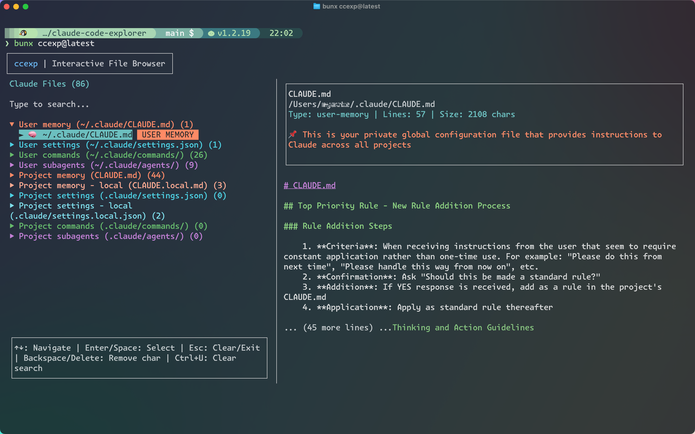
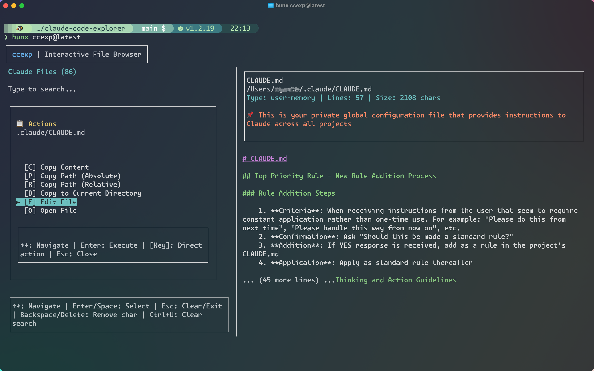

# ccexp (claude-code-explorer)

<div align="center">
  
  <br><br>
  <strong>Interactive CLI tool for exploring and managing Claude Code settings and slash commands</strong>
  <br><br>
  <a href="https://www.npmjs.com/package/ccexp">
    
  </a>
  <a href="https://www.npmjs.com/package/ccexp">
    
  </a>
  <a href="https://github.com/nyatinte/ccexp/blob/main/LICENSE">
    
  </a>
  <a href="https://github.com/nyatinte/ccexp">
    
  </a>
  <a href="https://github.com/hesreallyhim/awesome-claude-code">
    
  </a>
</div>

## Overview

> [!IMPORTANT]
> **ccexp** is the shortened name for **claude-code-explorer**. The npm package [claude-code-explorer](https://www.npmjs.com/package/claude-code-explorer) is the previous version of this tool. The name was shortened to **ccexp** for brevity and easier command-line usage.

**ccexp** (short for **claude-code-explorer**) is a React Ink-based CLI tool that provides an interactive terminal interface for discovering, previewing, and managing Claude Code configuration files and slash commands. Navigate through your codebase to find CLAUDE.md files, slash command definitions, and other Claude-related configurations with a beautiful terminal UI.

## Features

- 🔍 **Interactive File Discovery** - Automatically finds Claude Code configuration files
- 📁 **Split-pane Interface** - File list on the left, preview on the right
- ⌨️ **Keyboard Navigation** - Arrow keys, Enter, ESC for smooth navigation
- 🔎 **Live Search** - Filter files as you type
- 📋 **File Actions** - Copy content, copy paths, open files in default applications
- 🎨 **Terminal UI** - Beautiful React Ink interface with proper focus management
- 📝 **Markdown Preview** - Renders CLAUDE.md files with syntax highlighting

## Screenshots

<div align="center">
  
  <br><br>
  
  <br><br>
  
</div>

## Target Files

ccexp (claude-code-explorer) automatically discovers these configuration files:

- **CLAUDE.md** → Project-level configuration (most common)
- **CLAUDE.local.md** → Local overrides (gitignored)
- **~/.claude/CLAUDE.md** → Global user configuration
- **.claude/commands/**/*.md** → Slash command definitions

## Installation

### Quick Start (Recommended)

No installation required! Run directly with:

```bash
# Using Bun (fastest)
bunx ccexp@latest

# Using npm
npx ccexp@latest

# Using pnpm
pnpm dlx ccexp@latest
```

### Global Installation

For frequent use, install globally:

```bash
# npm
npm install -g ccexp

# Bun
bun install -g ccexp

# pnpm
pnpm add -g ccexp
```

Then run from anywhere:

```bash
ccexp
```

## Usage

### Interactive Mode (Default)

```bash
ccexp                    # Launch interactive TUI
ccexp --path ~/projects # Scan specific directory
```

### Command Line Options

```bash
ccexp --help             # Show help information
ccexp --version          # Show version number
ccexp --path <path>      # Specify directory to scan
```

### Examples

```bash
# Launch in current directory
bunx ccexp@latest

# Scan specific project
bunx ccexp@latest --path ~/my-project

# Quick exploration without installation
npx ccexp@latest

# Show help
bunx ccexp@latest --help

# Show version
bunx ccexp@latest --version
```

### Common Use Cases

```bash
# Find all Claude configuration in your workspace
cd ~/workspace
bunx ccexp@latest

# Check Claude settings in a specific project
bunx ccexp@latest --path ./my-project

# Explore global Claude configuration
bunx ccexp@latest --path ~/.claude

# Using alias (after setup)
ccexp                      # Current directory
ccexp --path ~/workspace   # Specific directory
```

## Keyboard Shortcuts

- **↑/↓** - Navigate file list
- **Enter** - Open file actions menu
- **ESC** - Close menu / Exit
- **Tab** - Switch between panes
- **/** - Focus search input
- **c** - Copy file content (in menu)
- **p** - Copy absolute path (in menu)
- **r** - Copy relative path (in menu)
- **d** - Copy file to current directory (in menu)
- **e** - Edit file with $EDITOR (in menu)
- **o** - Open file in default application (in menu)

## Development

For development setup, commands, and contribution guidelines, see [DEVELOPMENT.md](./DEVELOPMENT.md).

## Contributing

Contributions are welcome! Please see [DEVELOPMENT.md](./DEVELOPMENT.md#contributing) for detailed contribution guidelines.

## License

MIT License - see LICENSE file for details
